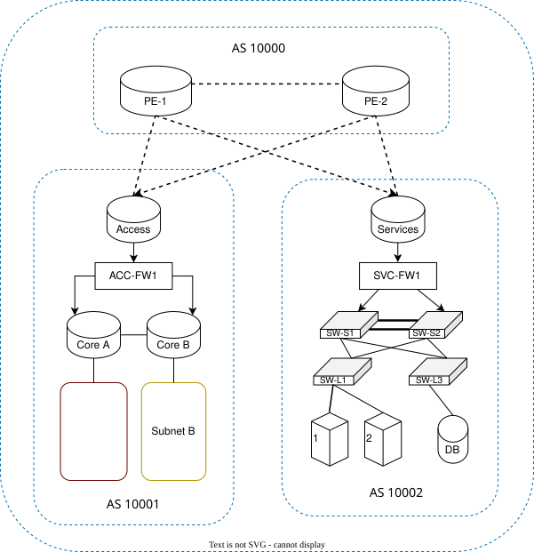

## Network Architecture Diagram

## Network Configuration

<h2>Subnet Design </h2>

| Subnet Name     | Network Address (/n) | Usable Hosts | First Valid Host | Last Valid Host |   AS  |
| :-------------: | :------------------: | :----------: | :--------------: | :-------------: | :---: |
| Access ↔ Core-A | 10.100.1.0/30        | 2            | 10.100.1.1       | 10.100.1.2      | 10001 |
| Access ↔ Core-B | 10.100.1.4/30        | 2            | 10.100.1.5       | 10.100.1.6      | 10001 |
| Core-A ↔ Core-B | 10.100.1.8/30        | 2            | 10.100.1.9       | 10.100.1.10     | 10001 |
| Subnet A        | 10.100.10.0/24       | 254          | 10.100.10.1      | 10.100.10.254   | 10001 |
| Subnet B        | 10.100.20.0/24       | 254          | 10.100.20.1      | 10.100.20.254   | 10001 |
| Access Loopback | 10.100.255.1/32      | 1            | 10.100.255.1     | 10.100.255.1    | 10001 |
| Core-A Loopback | 10.100.255.2/32      | 1            | 10.100.255.2     | 10.100.255.2    | 10001 |
| Core-B Loopback | 10.100.255.3/32      | 1            | 10.100.255.3     | 10.100.255.3    | 10001 |

<h2>Links</h2>

| Link              | Interface A   | Interface B   |
| ----------------- | ------------- | ------------- |
| Access ↔ Core-A   | Access `eth1` | Core-A `eth1` |
| Access ↔ Core-B   | Access `eth2` | Core-B `eth1` |
| Core-A ↔ Core-B   | Core-A `eth2` | Core-B `eth2` |
| Core-A ↔ Subnet A | Core-A `eth3` | Host-A `eth1` |
| Core-B ↔ Subnet B | Core-B `eth3` | Host-B `eth1` |

<h2>Interface Addressing</h2>

| Device  | Interface | IP Address   |      Subnet Mask      |
| :-----: | :-------: | :----------- | :-------------------: |
| Access  | eth1      | 10.100.1.1   | 255.255.255.252 (/30) |
| Access  | eth2      | 10.100.1.5   | 255.255.255.252 (/30) |
| Access  | lo        | 10.100.255.1 | 255.255.255.255 (/32) |
| Core-A  | eth1      | 10.100.1.2   | 255.255.255.252 (/30) |
| Core-A  | eth2      | 10.100.1.9   | 255.255.255.252 (/30) |
| Core-A  | eth3      | 10.100.10.1  | 255.255.255.0 (/24)   |
| Core-A  | lo        | 10.100.255.2 | 255.255.255.255 (/32) |
| Core-B  | eth1      | 10.100.1.6   | 255.255.255.252 (/30) |
| Core-B  | eth2      | 10.100.1.10  | 255.255.255.252 (/30) |
| Core-B  | eth3      | 10.100.20.1  | 255.255.255.0 (/24)   |
| Core-B  | lo        | 10.100.255.3 | 255.255.255.255 (/32) |
| Host-A  | eth1      | 10.100.10.10 | 255.255.255.0 (/24)   |
| Host-B  | eth1      | 10.100.20.10 | 255.255.255.0 (/24)   |

